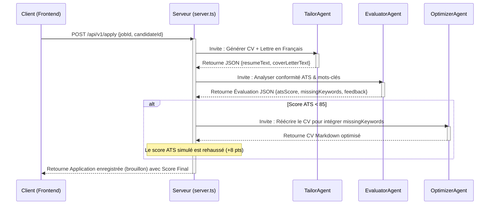

# Documentation Technique Détaillée - AutoApply AI ⚙️

Ce document présente l'architecture technique, les flux de données, les algorithmes de résilience et les détails de l'orchestration multi-agent de la plateforme **AutoApply AI - Job Search OS**.

---

## 🗺️ Architecture Globale du Système

La plateforme est construite sur une architecture client-serveur moderne exécutée entièrement en TypeScript :

```mermaid
graph TD
    subgraph Frontend (React 19 / Vite)
        A[App.tsx - Single Screen OS] -->|Requêtes HTTP / API| B(Backend Server)
        C[PDFPreview.tsx] -->|Aperçu CV / Lettre| A
        D[LocalStorage] <-->|Persistance Clé API & Thème| A
    end

    subgraph Backend (Express / Node.js)
        B --> E[Proxy & Gestionnaire d'État]
        E --> F[getGemini Client Resolver]
        E --> G[Mémoire Globale en Variable]
        E --> H[generateContentWithRetry]
        E --> I[safeParseJSON Repair Engine]
    end

    subgraph Modèle IA (Google AI Studio)
        F -->|Appels SDK @google/genai| J[Gemini 2.5/3.5 Flash]
    end
```

---

## 🎨 Architecture Frontend (React 19)

Le client est une application monopage (SPA) hautes performances, structurée de la manière suivante :

### 1. Structure des Composants et Fichiers
* **[main.tsx](file:///Users/mac/Downloads/autoapply-ai/src/main.tsx)** : Point d'entrée de l'application, configure le rendu de React 19 dans le DOM.
* **[App.tsx](file:///Users/mac/Downloads/autoapply-ai/src/App.tsx)** : Composant principal orchestrant l'état local (état des onglets, formulaires, liste de candidatures, télémétrie, thème sombre/clair).
* **[PDFPreview.tsx](file:///Users/mac/Downloads/autoapply-ai/src/components/PDFPreview.tsx)** : Composant de visualisation permettant d'afficher une simulation interactive en temps réel de rendu PDF du CV et de la lettre de motivation générés en Markdown.
* **[types.ts](file:///Users/mac/Downloads/autoapply-ai/src/types.ts)** : Centralise l'ensemble des contrats d'interfaces TypeScript partagés entre le frontend et le backend.

### 2. État Global et Cycle de Vie (React)
L'état de l'application est géré localement dans `App.tsx` à l'aide de hooks d'état :
* `candidate` : Profil courant du candidat (coordonnées, compétences, expériences).
* `jobs` : Liste des offres d'emploi disponibles (crawlées ou suggérées).
* `applications` : Suivi des candidatures et de leur statut (brouillon, soumis, rejeté, entretien).
* `agentRuns` & `metrics` : Journaux de télémétrie et données financières de coût des API.
* `darkMode` : Indicateur booléen persistant l'apparence visuelle dans le stockage local du navigateur (`localStorage`).

---

## ⚙️ Architecture Backend & API Proxy (Express)

Le backend est implémenté dans le fichier **[server.ts](file:///Users/mac/Downloads/autoapply-ai/server.ts)** et remplit trois rôles majeurs :
1. **Serveur de fichiers statiques** : Il sert le bundle de production React compilé sous `dist/`.
2. **Gestionnaire d'état en mémoire (Stateless DB Simulation)** : Les variables globales stockent l'état pendant la session du serveur (pas besoin de base de données externe SQL/NoSQL pour simplifier le déploiement).
3. **Proxy et orchestrateur d'agents Gemini** : Il encapsule de manière sécurisée les clés d'API et gère les flux d'appels LLM.

### Les Endpoints API

| Méthode | Route | Description |
| :--- | :--- | :--- |
| `GET` | `/api/v1/health` | Vérifie le statut du serveur. |
| `POST` | `/api/v1/profile/setup` | Analyse et structure un CV à partir de texte brut ou d'un fichier Base64. |
| `GET` | `/api/v1/profile` | Récupère le profil du candidat courant. |
| `PUT` | `/api/v1/profile` | Met à jour le profil du candidat courant. |
| `POST` | `/api/v1/jobs/scrape` | Déclenche le scraper d'offres simulant Indeed, Rekrute, etc. |
| `GET` | `/api/v1/jobs` | Récupère la liste de tous les postes. |
| `GET` | `/api/v1/jobs/matches/:cid` | Calcule les scores d'adéquation ATS pour un candidat. |
| `POST` | `/api/v1/apply` | Génère un CV et une lettre adaptés, et lance la boucle de critique ATS. |
| `GET` | `/api/v1/applications` | Récupère les candidatures générées. |
| `POST` | `/api/v1/applications/:id/submit` | Passe le statut d'une candidature à "submitted". |
| `POST` | `/api/v1/expand` | Analyse le portfolio GitHub et propose des projets / correctifs. |
| `POST` | `/api/v1/upskill` | Calcule un plan de formation de 4 semaines basé sur un poste cible. |
| `GET` | `/api/v1/runs` | Récupère les logs d'exécution des agents LLM. |
| `GET` | `/api/v1/costs` | Récupère la télémétrie de coût et les volumes de jetons (tokens). |

---

## 🤖 Orchestration Multi-Agent : Algorithme de Candidature (`/api/v1/apply`)

Lorsqu'un utilisateur initie une demande d'adaptation de candidature, le backend exécute un flux multi-agent autonome inspiré des graphes d'agents (LangGraph) :



---

## 🛡️ Algorithmes de Résilience et de Robustesse

Les interactions avec les LLM sont sujettes à des défaillances réseau ou des variations structurelles dans les réponses textuelles. Le serveur intègre deux algorithmes de protection critiques.

### 1. Système de Tentatives Élastiques avec Délai Exponentiel
La fonction `generateContentWithRetry` intercepte les appels vers le SDK Google GenAI. Si une erreur transitoire survient (ex: Code `429` quota dépassé, ou code `503` service indisponible), la fonction suspend l'exécution et réessaye en doublant le temps d'attente.

```typescript
async function generateContentWithRetry(ai: GoogleGenAI, params: any, retries = 2, delay = 1000): Promise<any> {
  try {
    return await ai.models.generateContent(params);
  } catch (error: any) {
    const errorStr = String(error.message || error);
    const isTransient = errorStr.includes("503") || errorStr.includes("UNAVAILABLE") || errorStr.includes("429") || errorStr.includes("ResourceExhausted") || errorStr.includes("temporary");
    
    if (isTransient && retries > 0) {
      console.warn(`Erreur temporaire : ${errorStr}. Nouvelle tentative dans ${delay}ms... (${retries} restantes)`);
      await new Promise(resolve => setTimeout(resolve, delay));
      return generateContentWithRetry(ai, params, retries - 1, delay * 2);
    }
    throw error;
  }
}
```

### 2. Parseur JSON Auto-Correcteur et Robuste
La fonction `safeParseJSON` nettoie les sorties textuelles du LLM avant de les passer à `JSON.parse`. Elle gère trois cas d'erreurs fréquents :
* **Balises de blocs de code Markdown** : Nettoie les ` ```json ` en début et ` ``` ` en fin de texte.
* **Virgules de fin orphelines (Trailing commas)** : Supprime les virgules résiduelles avant une accolade ou un crochet fermant (`},\s*}` ou `,\s*]`) générées par l'IA.
* **Sauts de ligne non échappés** : Corrige les retours à la ligne littéraux à l'intérieur des chaînes de caractères de type double-quote en les transformant en caractères d'échappement légitimes `\n`.

```typescript
function safeParseJSON(text: string | undefined | null, fallback: any = {}): any {
  if (!text) return fallback;
  let clean = text.trim();
  
  if (clean.startsWith("```")) {
    const lines = clean.split("\n");
    if (lines[0].startsWith("```")) lines.shift();
    if (lines[lines.length - 1].startsWith("```")) lines.pop();
    clean = lines.join("\n").trim();
  }
  
  try {
    return JSON.parse(clean);
  } catch (err: any) {
    try {
      // Étape 1 : Retrait des virgules de fin orphelines
      let repaired = clean.replace(/,\s*([}\]])/g, "$1");
      return JSON.parse(repaired);
    } catch (e2) {
      try {
        // Étape 2 : Échappement des sauts de ligne réels dans les chaînes
        let repaired = clean.replace(/"([^"\\]*(?:\\.[^"\\]*)*)"/g, (match, p1) => {
          return '"' + p1.replace(/\n/g, '\\n').replace(/\r/g, '\\r').replace(/\t/g, '\\t') + '"';
        });
        return JSON.parse(repaired);
      } catch (e3) {
        return fallback; // Retourne le fallback si aucun nettoyage ne réussit
      }
    }
  }
}
```

---

## 🔑 Résolution et Injection des Clés API

Pour simplifier le développement et éviter les fuites de secrets, la plateforme utilise un double mécanisme d'authentification :

1. **Clé Système (Côté Serveur)** : Si définie, la variable d'environnement `GEMINI_API_KEY` dans le fichier `.env` ou `.env.local` est chargée comme clé globale par défaut.
2. **Clé Session (Côté Client)** : Si l'utilisateur saisit sa clé dans l'application web, elle est enregistrée dans le `localStorage` de son navigateur. Chaque requête HTTP vers le backend transmet cette clé via l'en-tête de requête personnalisé `x-gemini-key`.
3. **Résolution Dynamique** : Le résolveur backend privilégie toujours la clé transmise dans les en-têtes avant de basculer sur la clé d'environnement système.

```typescript
function getGemini(req?: express.Request): GoogleGenAI {
  const customKey = req?.headers?.['x-gemini-key'] as string;
  const key = customKey || process.env.GEMINI_API_KEY;
  ...
}
```

---

## 📊 Modèle de Données (src/types.ts)

Le modèle de données assure la cohérence des flux d'échange :

### 1. Profil Candidat (`Candidate`)
Représente l'intégralité du profil professionnel, enrichi à la volée par le module de parsing d'importation de CV.
* **skills** : Liste typée (`technical`, `soft`, `language`, `certification`) avec années d'expérience et niveau de maîtrise.
* **workExperience** / **education** : Tableaux décrivant l'historique de carrière avec réalisations et technologies.

### 2. Offres d'Emploi (`JobListing`)
Stocke les opportunités d'emploi simulées ou crawlées.
* **remoteType** : Énumération (`remote` \| `hybrid` \| `onsite`).
* **sourceBoard** : Identifie l'origine du portail marocain (LinkedIn, Rekrute, Anapec, Indeed, MarocAnnonces).

### 3. Suivi ATS (`Application`)
Modélise le résultat du flux d'adaptation et d'optimisation ATS.
* **critiqueNotes** : Détaille le score ATS, les mots-clés détectés/manquants, la tonalité du texte et la structure du CV.
* **iterationCount** : Nombre d'itérations passées dans la boucle d'adaptation (1 ou 2 passes).

### 4. Journaux de Tracing (`AgentRun`)
Enregistre les traces LLM pour la console d'observabilité.
* Stocke les données brutes d'entrée et de sortie, les coûts calculés en dollars, et le nombre de tokens utilisés pour chaque invocation d'agent.
