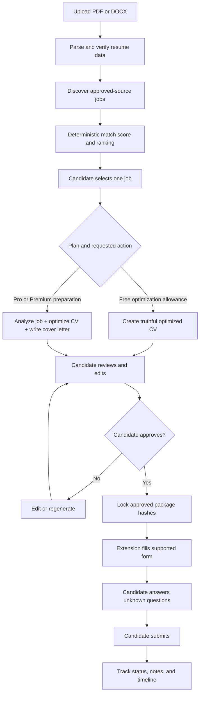

# ApplyAI project use cases

## Purpose

ApplyAI helps a candidate move through one controlled workflow:

> verified resume → relevant jobs → explainable match → tailored materials →
> human approval → assistive form filling → application tracking

The product is not a background bot that applies everywhere. It reduces
repeated work while keeping the candidate responsible for facts, job choice,
screening answers, and final submission.

## Actors

| Actor                  | Responsibilities                                                                                                                 |
| ---------------------- | -------------------------------------------------------------------------------------------------------------------------------- |
| Candidate              | Owns the resume, selects jobs, reviews generated content, approves materials, answers unknown questions, and submits             |
| Free candidate         | Evaluates the workflow with bounded discovery, AI, optimization, resume, and tracking quotas                                     |
| Pro/Premium candidate  | Uses unified preparation and the connected extension in addition to the Free foundation                                          |
| Chrome extension       | Captures the user-opened posting, displays match evidence, and fills only an approved package                                    |
| ApplyAI API/workers    | Enforce ownership and quotas, parse resumes, ingest approved sources, score jobs, generate materials, and persist workflow state |
| Administrator/operator | Configures approved public sources, observes usage, and operates the service; cannot bypass tenant ownership                     |
| External providers     | Public job-board APIs, AI provider, object storage, email, and Stripe                                                            |

## Product boundaries

ApplyAI currently:

- accepts PDF and DOCX resumes;
- parses resume facts into structured, user-owned data;
- refreshes configured Greenhouse, Lever, and Ashby public JSON APIs;
- ranks jobs using a deterministic scorer that does not call an LLM;
- returns no more than 20 jobs per discovery run;
- generates only from the user's verified experience and the selected job;
- lets the user edit, regenerate, approve, and track materials;
- lets the extension fill an approved package;
- requires the human to perform final submission.

ApplyAI does not:

- bulk scrape arbitrary websites or search-result pages;
- take screenshots of job pages for routine capture;
- crawl LinkedIn, Indeed, Rekrute, Anapec, or MarocAnnonces from the backend;
- invent qualifications, employers, dates, degrees, or achievements;
- answer unknown screening questions;
- click the final Submit button.

## Workflow overview

The same preparation path can start from a pasted job description or from a
specific job page captured by the extension.

## UC-01 — Upload and parse a resume

**Primary actor:** Candidate

**Goal:** Establish the verified source of truth used by later scoring and
generation.

### Preconditions

- The candidate is authenticated and has accepted the required data-processing
  consent.
- The file is a supported PDF or DOCX within the plan's count and storage
  limits.

### Main flow

1. The candidate uploads a resume.
2. The API validates ownership, extension, MIME type, size, and archive safety.
3. The file is stored through the local-development or S3 storage adapter.
4. A worker extracts text and asks the configured AI provider for structured
   resume data.
5. The structured output is validated and attached to the owned resume.
6. The resume becomes ready for discovery and optimization.

### Result

The original file and parsed facts form the evidence base. Later generated CVs
are versions; they do not replace the original evidence.

### Quota and cost

Parsing is an AI operation and consumes an AI request. Resume count and storage
limits are also enforced.

### Failure/recovery

- Invalid or unsafe files are rejected before parsing.
- A provider or worker failure leaves the resume in a recoverable failed state;
  retry controls remain bounded and auditable.
- A candidate can delete the owned resume and its dependent data.

## UC-02 — Discover and rank up to 20 jobs

**Primary actor:** Candidate

**Goal:** Find relevant jobs without sending the complete resume to an LLM for
every candidate.

### Preconditions

- The candidate owns a parsed, ready resume.
- At least one approved source is configured or approved jobs already exist in
  the database.
- The monthly discovery allowance is available.

### Main flow

1. The candidate starts discovery from a selected resume.
2. If the refresh TTL has expired, the API reads the configured Greenhouse,
   Lever, and Ashby public JSON APIs.
3. Ingested jobs are normalized and deduplicated.
4. The system considers a bounded candidate pool and compares each job with the
   original verified resume.
5. Match score v2 applies weighted evidence, hard requirements, experience
   duration, English/French aliases, and confidence rules.
6. Cached scores are reused when the resume hash, job hash, and scorer version
   are unchanged.
7. Up to 20 ranked jobs are returned with matched evidence, gaps, and
   explanations.
8. The candidate explicitly chooses whether to continue with any job.

### Result

The user gets a shortlist, not an automatic application queue.

### Quota and cost

- Free: 3 discovery runs/month.
- Pro: 50 discovery runs/month.
- Premium: unlimited discovery runs.
- A discovery result contains at most 20 jobs.
- Deterministic scoring consumes **zero AI requests/tokens**.

### Failure/recovery

- If a source is unavailable, the provider circuit/fallback behavior is bounded
  and existing approved jobs can still be ranked.
- If no source is configured, the UI should explain that an operator must
  configure approved boards; it must not silently start HTML scraping.

## UC-03 — Free candidate optimizes one CV

**Primary actor:** Free candidate

**Goal:** Test the core value of truthful job-specific resume optimization.

### Main flow

1. The candidate selects a discovered job or provides a job description.
2. The system checks the Free AI and optimization allowances.
3. The AI proposes stronger wording and relevance based only on verified resume
   facts.
4. Output validation rejects unsupported claims.
5. A classic ATS-friendly resume version is persisted.
6. The candidate reviews the content and can download its authenticated PDF.

### Quota

Free includes 5 AI requests and 1 CV optimization per month. Resume parsing and
other AI operations draw from the same AI-request allowance.

### Plan boundary

The connected job-analysis + optimized-CV + cover-letter preparation workflow
and extension access require Pro or Premium.

## UC-04 — Prepare one connected application package

**Primary actor:** Pro/Premium candidate

**Goal:** Turn the selected job into one reviewable application package rather
than running disconnected tools.

### Main flow

1. The candidate selects the ready resume and captured/discovered job.
2. The preparation endpoint creates an owned application.
3. The workflow moves through:
   `job_captured → analyzing → generating → ready_for_review`.
4. The AI produces structured job analysis.
5. The AI creates a truthful optimized CV version.
6. The AI creates a tailored cover letter.
7. The dashboard presents the materials together.
8. The candidate edits or requests bounded regeneration.
9. After approval, ApplyAI records hashes of the exact approved materials and
   moves the application to `ready_to_submit`.

### Result

The CV, cover letter, job, and application share one owned workflow state.

### Quota and cost

Job analysis, CV optimization, cover-letter generation, and regeneration are
AI operations. A complete preparation can therefore consume several AI
requests. The API reserves and rolls back quota atomically where applicable.

### Failure/recovery

- Partial generation is not presented as approved.
- A failed stage remains attached to the application so the user can retry
  without losing the selected job.
- Changing material after approval requires review/approval of the new version
  before extension filling.

## UC-05 — Capture a user-opened Moroccan job

**Primary actor:** Candidate using the extension

**Goal:** Bring a specific posting into ApplyAI when the site does not expose an
approved backend aggregation API.

### Supported pages

- Indeed Morocco
- Rekrute
- Anapec
- MarocAnnonces

### Main flow

1. The candidate opens the detailed page for one job.
2. The candidate invokes the ApplyAI extension.
3. The adapter reads Schema.org `JobPosting` data when available.
4. It falls back to bounded, site-specific DOM selectors for title, employer,
   location, and description.
5. The candidate sees the captured job and can request analysis.
6. The normalized content is sent to the authenticated ApplyAI API.

### Important boundary

This is not screen capture. The extension does not send a screenshot to an AI
model, and it does not scan 20 jobs from the current search-results page. Bulk
discovery is reserved for configured official/public JSON APIs.

## UC-06 — Fill an approved application

**Primary actor:** Pro/Premium candidate using the extension

**Goal:** Reduce repeated form entry without losing control.

### Preconditions

- The dashboard and extension are linked through the short-lived, single-use
  handoff.
- The application is owned by the candidate and is `ready_to_submit`.
- The package hashes still match the approved CV and cover letter.
- The current page has a supported adapter.

### Main flow

1. The extension retrieves the approved package from the API.
2. It fills known identity/profile fields.
3. It attaches or fills the approved resume and cover-letter material where the
   site permits.
4. It identifies fields it cannot answer safely.
5. The candidate reviews all fields and answers unknown screening questions.
6. The candidate clicks the site's final Submit button.
7. The candidate updates the tracked application status.

### Safety rules

- The extension never retrieves another user's package.
- Unapproved or changed material cannot be filled as approved.
- The extension does not infer legal eligibility, salary commitments, or
  sensitive screening answers.
- The extension never performs final submission.

## UC-07 — Track an application

**Primary actor:** Candidate

**Goal:** Maintain an accurate, private record after preparation or submission.

### Main flow

1. An application is created by preparation or manually.
2. The candidate views it in list, review, or Kanban form.
3. The candidate updates the status as the real process changes.
4. The candidate adds private notes.
5. ApplyAI preserves a timeline of meaningful events.
6. The candidate can delete the owned application.

Free supports 10 tracked applications; Pro and Premium support unlimited
tracked applications.

## UC-08 — Upgrade, downgrade, and enforce limits

**Primary actor:** Candidate

**Supporting actor:** Stripe

### Main flow

1. The candidate selects Pro or Premium.
2. The API creates a Stripe Checkout session.
3. Signed, idempotently recorded webhooks reconcile subscription state.
4. The API applies the current plan entitlements to every protected operation.
5. The billing portal manages payment method, cancellation, or plan changes.
6. On downgrade, paid-only extension sessions and operations are rejected.

### Enforcement rule

Rate limits and product quotas are different controls:

- cross-replica request throttling protects infrastructure;
- authenticated requests are keyed by verified user ID;
- unauthenticated/public requests use a trusted-proxy-aware IP;
- plan counters restrict AI, optimization, discovery, resume, storage, and
  application usage.

IP alone is not used as the plan identity because shared networks would combine
unrelated candidates and a user could change IP addresses.

## UC-09 — Export or erase personal data

**Primary actor:** Candidate

**Goal:** Exercise privacy controls.

### Main flow

1. The candidate opens privacy settings.
2. The candidate can export owned profile and product data without application
   secrets.
3. The candidate can revoke sessions and extension access.
4. The candidate can request account erasure.
5. ApplyAI removes owned database/file data and coordinates configured billing
   cleanup.

Destructive privacy operations require the authenticated owner and appropriate
confirmation.

## UC-10 — Configure and ingest an approved job board

**Primary actor:** Administrator/operator

**Goal:** Make permitted jobs available to discovery.

### Main flow

1. The operator verifies the source is an approved public API and that its use
   is legally/contractually acceptable.
2. The operator configures the provider and board token/name.
3. The ingestion path calls only the allow-listed provider host.
4. Responses are size/time bounded, normalized, and persisted.
5. Users discover the normalized jobs through their own resume-ranked results.

### Provider mapping

| Configuration            | Provider endpoint family      |
| ------------------------ | ----------------------------- |
| `greenhouse:board-token` | Greenhouse Job Board API      |
| `lever:site-name`        | Lever Postings API            |
| `ashby:job-board-name`   | Ashby public Job Postings API |

An admin endpoint is not permission to add arbitrary scraper targets.

## UC-11 — Ask Nori about careers in Morocco

**Primary actor:** Visitor or authenticated candidate

**Goal:** Get practical, source-bounded guidance about jobs, CVs, interviews,
skills, and job-search processes in Morocco.

### Main flow

1. Nori appears as an original robot mascot in the website corner.
2. While the visitor scrolls, the mascot follows a curved, viewport-safe path
   and returns to its resting corner after scrolling stops.
3. The visitor opens the chat and asks a Morocco career question.
4. The API validates a bounded conversation and applies a separate user-ID or
   trusted-IP rate limit.
5. The independent Dahl provider receives the career system prompt, public
   Morocco context, and recent bounded conversation only.
6. Nori answers in English, French, or Moroccan Arabic when practical.
7. Only allow-listed official or indexed-job URLs cited by the answer become
   clickable source links.
8. The conversation remains in browser memory and is not persisted.

### Isolation and safety

- Nori does not call the CV/application `AIService`.
- Chat questions do not consume the Free/Pro/Premium CV AI allowance.
- Nori does not automatically read resumes, profiles, or applications.
- Nori does not invent active listings or provide guaranteed legal,
  immigration, salary, or hiring outcomes.
- The Dahl key remains in the backend environment.
- The mascot becomes stationary on mobile and for reduced-motion users.

## Plan decision matrix

| User action                   |                      Free |                         Pro |                                                                Premium |
| ----------------------------- | ------------------------: | --------------------------: | ---------------------------------------------------------------------: |
| Upload and parse resume       | Yes, within 1 resume/5 MB | Yes, within 5 resumes/25 MB |                           Yes, within the enforced 2 GB storage ceiling |
| View explainable match score  |                       Yes |                         Yes |                                                                    Yes |
| Discover up to 20 ranked jobs |              3 runs/month |               50 runs/month |                                                              Unlimited |
| Truthful CV optimization      |                   1/month |                   Unlimited |                                                              Unlimited |
| Unified preparation package   |                        No |                         Yes |                                                                    Yes |
| Extension capture/fill        |                        No |                         Yes |                                                                    Yes |
| Track applications            |                        10 |                   Unlimited |                                                              Unlimited |
| AI requests                   |                   5/month |                   500/month |                                                              Unlimited |
| Nori career-chat questions    |    Separate 20/hour limit |      Separate 20/hour limit |                                                 Separate 20/hour limit |

## Operation-to-AI usage

| Operation                      | AI request/tokens? | Reason                                                    |
| ------------------------------ | -----------------: | --------------------------------------------------------- |
| Upload file validation/storage |                 No | Deterministic validation and storage                      |
| Resume parsing                 |                Yes | AI converts extracted text into structured candidate data |
| Refresh public job APIs        |                 No | JSON API ingestion and normalization                      |
| Match score/ranking            |                 No | Deterministic scorer with hash cache                      |
| Structured job analysis        |                Yes | AI interprets requirements                                |
| CV optimization                |                Yes | AI drafts truthful targeted content                       |
| Cover-letter generation        |                Yes | AI drafts job-specific prose                              |
| Extension DOM capture          |                 No | Page metadata/DOM extraction                              |
| Approved-package autofill      |                 No | Deterministic mapping into form fields                    |
| Nori Morocco career question   |      Separate Dahl | Independent provider; does not consume CV AI requests     |

## Example scenario

Yasmine is a junior data analyst in Casablanca.

1. She creates a Free account and uploads her PDF resume.
2. ApplyAI parses her verified skills: Excel, SQL, Power BI, French, English,
   internships, dates, and education.
3. She runs discovery. ApplyAI refreshes configured public company boards,
   evaluates the bounded job pool without LLM calls, and shows 20 or fewer
   ranked jobs.
4. A Business Intelligence Analyst position scores 78. The explanation shows
   strong SQL/Power BI overlap, partial experience coverage, and missing
   Tableau.
5. Yasmine selects the job. She does not claim Tableau because it is absent from
   her source resume.
6. On Free, she uses her monthly optimization to produce a cleaner ATS CV that
   emphasizes her verified dashboard project and quantified internship result.
7. If she upgrades to Pro, she can prepare the connected job analysis, CV, and
   cover letter, approve them, and use the extension to fill a supported form.
8. She reviews the employer's questions herself, submits, and records the
   application as Applied.

The important outcome is not more automatic submissions. It is a faster,
better-evidenced application that still represents the candidate truthfully.
